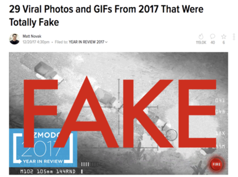
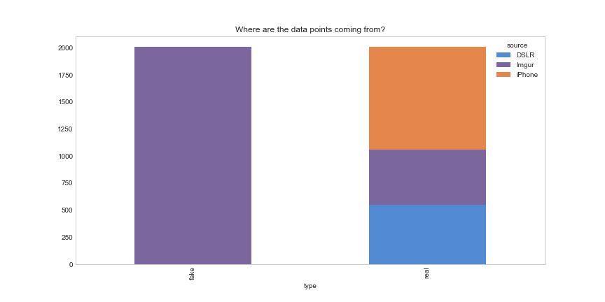
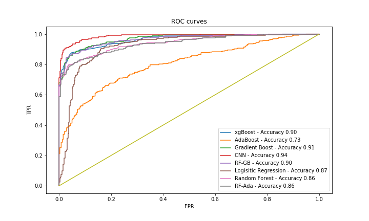
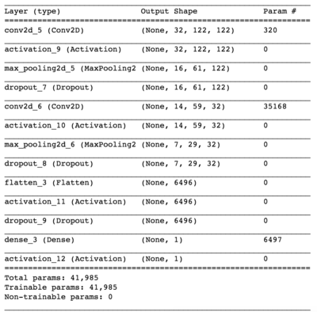
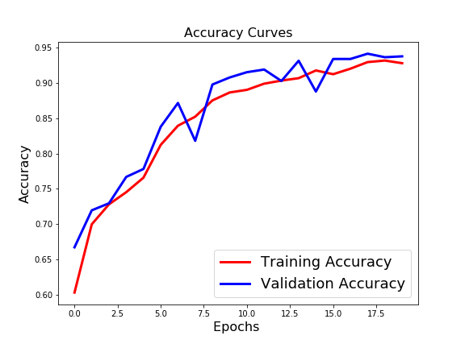

# Is this image fake?

Using machine learning to detect digitally altered images with Error Level Analysis.

## Table of Contents

* [Introduction](#intro)
* [Error Level Analysis](#ela)
* [Data Flow](#data)
* [Model Selection](#selection)
* [Convolutional Neural Network](#cnn)
* [Results](#results)
* [What's Next?](#next)
* [References](#ref)

## Introduction: <a id="intro"></a>

Recently I read an article from The Verge titled "[Artificial Intelligence is going to make it easier than ever to fake images and videos](https://www.theverge.com/2016/12/20/14022958/ai-image-manipulation-creation-fakes-audio-video)".  From experience, I have personally seen fake images, usually photoshopped, being retweeted and shared among my social feed.  As the Verge article suggests, there is a proliferation of realistic fakes mainly due to how easy it is to create a fake by leveraging machine learning tools.  These images can seriously look very realistic.



I was curious, if machine learning enables the ability to create fakes, can I use machine learning to detect if an image was fake?  The implications of a fake image being distributed from the internet can easily sway a person's opinion and boost one's agenda.  I thought this bwas an issue worth tackling.

#### Challeneges: <a id="challenges"></a>

Just using machine learning models by itself isn't enough to classify if an image was fake.  There isn't a common factor among the fake images for the machine learning model to learn from.  We will have to feed our model another type of image instead of the original one.  Enter Error Level Analysis.

## Error Level Analysis: <a id="ela"></a>

One powerful open sourced algorithm to help us is called Error Level Analysis.

It is a forensic method to identify portions of an image that has different levels of compression.  It will allow us to see areas of a photo that has been altered or changed.  We can use this technique to determine if a picture has been digitally modified.  The added fake contents (layers) on top of an image is different from that of the original image and most importantly, ELA can detect this.  If an image has not been modified, the altered grid should be at a higher error potential in respect to the remaining part of the image.

ELA works by re-saving the image at 90% - 95% compression and compares the difference between the original and the compressed.  Modified areas are easily seen in the ELA representation.

(Image in question)
(ELA representation)

Using the ELA image, we now can have a *common factor* among the fake images in hopes that our machine learning model can learn these signals.  Since reading ELA images requires a trained eye as the image can produce a wide range of variations, and painfully the process is not automated, we can leverage machine learning models to assist us.

Note: This technique is not perfect and we will go over the cavets in the 'What's next?' section.


## Data Flow: <a id="data"></a>

For our data, we need fake and real images.  Fake images are described as images that have been digitally altered in any way.  This includes images being touched up or going through photoshop.  Real images are described as images that are not altered.

The distributions of these sources:


- 2009 fake images from Imgur.
- 946 real images from iPhone.
- 550 real images from DSLR.
- 512 real images from Imgur.


Here is our data flow on how the model was trained and tested on:


---


## Model Selection: <a id="selection"></a>

Now that we have gathered our data and a general flow on how to train our model, we can now use the same pipeline to test on mutiple models.

Since this is a classification (predicting fake or not fake) problem, these models were taken into consideration:

* Logistic Regression
* Random Forest
* Gradient Boosting 
* AdaBoost
* xgBoost
* Random Forest + AdaBoost
* Random Forest + Gradient Boosting
* Convolutional Neural Network

Here is the results displayed under a ROC Curve.  A ROC Curve is a way to visual the performance of the binary classifer model.  The area under the curve (AUC) measures the performance of a binary classifier averaged across all possible decision thresholds.



<sup>Generally greater area under the curve, the better.</sup>

As you can see, **Convolutional Neural Network** gives us the best accuracy (94%) from our test set and has the highest AUC value.  Both the precision and recall are also high.  

In our case, **precision** ``` (TP)/(TP+FP) ``` tells us the proportion of images that we classified as fake are *actually* fake.  

**Recall** ``` (TP)/(TP+FN) ``` tells us what proportion of images that *actually* were fake were predicted by us as being fake.


We will continue by using Convolutional Neural Network as our model selection.

<sup>Please reference the EDA.ipynb file for a more detailed approach.</sup>

## Convolutional Neural Network: <a id="cnn"></a>

With the common factor among the fake images from ELA, we can now do some preprocessing on the ela image and feed it into the convolutional neural network (CNN).  

CNN is primarily used for image classification because it has the ability to learn basic things liked edges, dots, bright spots, and dark spots.  When a computer views an image, it sees an array of values depending on the size of the image.  The pixel values itself is between 0 to 225 which describes the pixel intensity.  We will feed in our CNN model with an array of numbers and the goal is for the model to output the probability of the image as fake.

Our network consists of 1 input layer, 1 hidden layer, and 1 output layer with Dropout in each layer to reduce overfitting by preventing a layer from seeing twice the exact same pattern.



## Results: <a id="results"></a>
### 94% accuracy with Convolutional Neural Network.

A closer dive into our model, 




Measuring loss function is very important as it is used to measure the inconsistency between predicted values.  It implies how well or poorly the model behaves after each iteration of optimization.  Ideally, we should expect the reduction of loss after several iterations.  

As the loss value converges around 20 epochs, the test accuracy is greater than training accuracy.  This means that the model has generalized very well with 94% accuracy.


## What's next?: <a id='next'></a>

We were able to get a relatively high accuracy by using Convolutional Neural Networks.  Even others models such as Gradient Boosting and random forest performed reasonably well.  I believe this has much to do with the the data preprocessing steps.  We were able to apply Error Level Analysis on the imags to give our models some signal or common factor between fake and real images.

**However, Error Level Analysis is not perfect.** As successive resave operation occurs, the error level will decrease over time.  After a number of resaves, the grid square reaches its minimum error level making it harder to detect the layers that were digitally touched.

Ultimately, I believe that ELA can compliment other existing verification techniques.  Other algorithms that we can implement are clone dectection, noise analysis, and even image metadata.


Check it out...
### [http://www.isthisimagefake.com](http://www.isthisimagefake.com)


## References: <a id='ref'></a>

* [https://ijcsits.org/papers/vol7no22017/4vol7no2.pdf](https://https://ijcsits.org/papers/vol7no22017/4vol7no2.pdf)
* [https://fotoforensics.com/tutorial-ela.php](https://fotoforensics.com/tutorial-ela.php)
* [http://cs231n.github.io/convolutional-networks/](http://cs231n.github.io/convolutional-networks/)