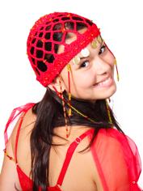
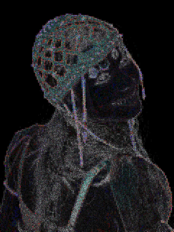
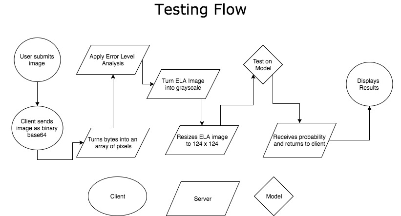

# Is this image fake?

Using machine learning to detect digitally altered images with Error Level Analysis.

## Table of Contents

* [Introduction](#intro)
* [Error Level Analysis](#ela)
* [Convolutional Neural Network](#cnn)
* [Data Flow](#data)
* [Other Models](#other)
* [Results and Roadmap](#close)
* [References](#ref)

## Introduction: 

Recently I read an article from The Verge titled "[Artificial Intelligence is going to make it easier than ever to fake images and videos](https://www.theverge.com/2016/12/20/14022958/ai-image-manipulation-creation-fakes-audio-video)".  From experience, I have personally seen fake images, usually photoshopped, being retweeted and shared among my social feed.  As the Verge article suggests, there is a proliferation of realistic fakes mainly due to how easy it is to create a fake by leveraging machine learning tools.  These images can seriously look very realistic.

I was curious, if machine learning enables the ability to create fakes, can I use machine learning to detect if an image was fake?  The implications of a fake image being distributed from the internet can easily sway a person's opinion and boost one's agenda.  I thought this was an issue worth tackling.

#### Challeneges: 

Just using machine learning models by itself isn't enough to classify if an image was fake.  There isn't a common factor among the fake images for the machine learning model to learn from.  We will have to feed our model another type of image instead of the original one.  Enter Error Level Analysis.

## Error Level Analysis: 

One powerful open sourced algorithm to help us is called Error Level Analysis.

It is a forensic method to identify portions of an image that has different levels of compression.  It will allow us to see areas of a photo that has been altered or changed.  We can use this technique to determine if a picture has been digitally modified.  The added fake contents (layers) on top of an image is different from that of the original image and most importantly, ELA can detect this.  If an image has not been modified, the altered grid should be at a higher error potential in respect to the remaining part of the image.

ELA works by re-saving the image at 90% - 95% compression and compares the difference between the original and the compressed.  Modified areas are easily seen in the ELA representation.

Using the ELA image, we now can have a common factor among the fake images in hopes that our machine learning model can learn these signals.

Note: This technique is not perfect and we will go over the cavets in the results section.

## Convolutional Neural Network: 

With the common factor among the fake images, we can now do some preprocessing on the ela image and feed it into the convolutional neural network (cnn).  CNN is primarily used for image classification because it has the ability to learn basic things liked edges, dots, bright spots, and dark spots.  When a computer views an image, it sees an array of values depending on the size of the image.  The pixel values itself is between 0 to 225 which describes the pixel intensity.  We will feed in our CNN model with an array of numbers and the goal is for the model to output the probability of the image as fake.

cont ...  

## Data Flow: 

For our data, we need fake and real images.  Fake images are described as images that have been digitally altered in any way.  This includes images being touched up or going through photoshop.  Real images are described as images that are no altered.

The distributions of these sources:

- 2009 fake images from Imgur.
- 946 real images from iPhone.
- 550 real images from DSLR.
- 512 real images from Imgur.

Here is our data flow on how the model was trained.

## Other Models: 

## Results: 
94% accuracy with Convolutional Neural Network

#### Check it out:

[http://www.isthisimagefake.com](http://www.isthisimagefake.com)

Note: App and ReadMe still work in progress...

## References: 